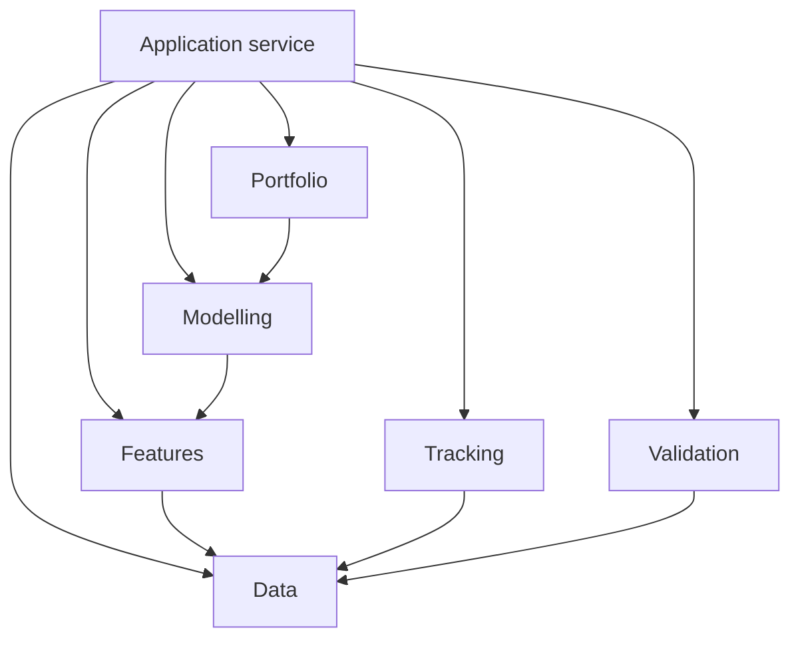

# Architecture

**Status:** living description of the implemented Slice 1 system and its planned evolution.
**Authority:** research rules remain governed by [FSD v2](FSD_v2.md); this document describes their implementation.

## Problem and system boundary

The practical problem is to turn information available after market close on session T into a ranked list of roughly 100 US equities, then test a weekly long-only portfolio entered at the next session's close. The ML problem is supervised regression of the five-session forward adjusted-close return, evaluated both as a numerical forecast and, more importantly, as a cross-sectional ranking signal. The research question is whether market and point-in-time SEC features improve ranking and after-cost portfolio outcomes relative to simple baselines.

This is a **layered local research application with application-service orchestration**. It is not a set of microservices. `trading_pipeline.run` is the authoritative application service: one process coordinates ingestion, validation, feature creation, splitting, training, frozen selection, evaluation, portfolio simulation and artefact persistence. Separate modules express research boundaries, not independently deployed services.

## Training and deployment contracts

### Training input and output

| Contract | Exact content |
|---|---|
| Market input | Daily `security_id`, ticker, session date, OHLC, adjusted close, volume and provenance from the immutable Yahoo cache |
| Fundamental input | SEC Company Facts for `EarningsPerShareBasic` in USD/shares and `NetIncomeLoss` in USD, including fiscal dates, filed date, form, accession and provenance |
| Feature input | F0's nine backward-looking market features; F1 adds latest strictly available EPS and Net Income |
| Label | `adjusted_close[t+5] / adjusted_close[t] - 1`; `label_end_date` is retained for purge checks |
| Split | Common chronological calendar, 60/20/20, overlapping labels purged, five sessions embargoed after each boundary |
| Training output | Four fitted pipelines (E1-E4), all candidate validation metrics, selected hyperparameters, validation predictions and a frozen E5 source decision |

Imputation and, for Elastic Net, scaling are fitted only on training rows. Candidate ranking uses validation mean daily Spearman IC, then validation RMSE, then stable grid order. Test labels are unavailable to selection.

### Deployment-style inference input and output

There is no live deployment in Slice 1. The implemented backtest emulates the decision boundary:

| Contract | Exact content |
|---|---|
| Input at T | One security-date row with features computed from bars through T and SEC facts with `filed_date < T` |
| Model output | `predicted_return_5d`, cross-sectional ordinal `predicted_rank`, model/feature IDs and split |
| Portfolio input | A complete cross-section of predictions plus trailing `vol_20d`; B0 instead consumes SPY prices |
| Portfolio output | Deterministic top-K weights: equal weight or normalized inverse volatility |
| Execution output | T+1-close trades, daily positions, costs, turnover, cash, exposure, daily return and equity |

Missing held prices, invalid keys, non-finite predictions or weights, incomplete mappings and point-in-time violations fail rather than being silently repaired.

## Implemented workflow

```mermaid
flowchart LR
    C[Validated YAML config<br/>fixed universe and seed] --> I[Data ingestion service]
    I --> R[(Immutable raw caches)]
    I --> D[(Curated Parquet<br/>DuckDB read views)]
    D --> F[F0/F1 feature assembly<br/>strict SEC as-of joins]
    F --> T[5-session target]
    T --> S[Purged and embargoed<br/>60/20/20 split]
    S --> M[Elastic Net and<br/>histogram GBT candidates]
    M --> V[Validation-only selection]
    V --> L[(selection.json lock)]
    L --> P[Test prediction once]
    P --> W[Weekly top-K<br/>P1/P2 weights]
    W --> B[T+1-close backtest<br/>10 bps one-way cost]
    B --> A[(Immutable run contract<br/>metrics, series, audit)]
    A --> Q[Read-only notebook<br/>and reporting]
```



```mermaid
sequenceDiagram
    participant O as Operator
    participant R as run.py application service
    participant D as Data/feature layers
    participant M as Modelling layer
    participant P as Portfolio layer
    participant A as Artefact/audit layer
    O->>R: config path
    R->>D: ingest, validate, snapshot, build target/splits
    D-->>R: immutable tables and split manifest
    R->>M: fit train; score validation candidates
    M-->>R: models, validation predictions, selection
    R->>A: persist selection before test scoring
    R->>M: predict held-out test once
    R->>P: rank, weight, simulate T+1
    P-->>R: positions, trades, curves, metrics
    R->>A: persist and integrity-audit run
    A-->>O: run directory or fail-fast error
```

## Components and ownership

| Layer | Modules | Responsibility and public boundary |
|---|---|---|
| Configuration/environment | `config.py`, `environment.py` | Validate locked policy values; record deterministic device/runtime evidence |
| Data | `data/*` | Fixed universe, official identifier bridge, source clients, schemas, raw caching, curated snapshots and DuckDB views |
| Features | `features/*` | Backward-looking F0 transforms and strict filed-date F1 as-of joins |
| Modelling | `modelling/*` | Label, temporal split, estimator factories, fixed grids, validation selection, predictions and forecast metrics |
| Portfolio | `portfolio/*` | Shared top-K selection, P1/P2 weights, T+1 accounting and financial metrics |
| Tracking | `tracking/*` | Hash/provenance helpers and plot persistence; it owns no research selection |
| Validation | `validation/*`, `audit.py` | Read completed artefacts and assert PIT, selection, trading and reconciliation invariants |
| Application | `run.py` | The only end-to-end execution path and experiment sequencing authority |
| Presentation | notebook and reporting package | Read-only derivation from a specified run; never fit or select |

Detailed package interfaces and invariants are documented in the README beside each package.

## Dependency direction



Lower layers do not call the application service. Portfolio code receives tables, not estimators. Reporting and notebooks are terminal readers. This dependency direction makes leakage and the single execution path reviewable.

## Architecture principles

- **YAGNI:** use local files, one process and two required estimator families; defer services and optimisers until evidence requires them.
- **One authoritative execution path:** production-like research runs originate in `trading_pipeline.run`; notebooks and reports consume persisted outputs.
- **Point-in-time correctness:** features use bars through T and only filings strictly before T; split boundaries purge overlapping labels.
- **Immutable run artefacts:** every execution receives a new run ID and run-local snapshots; reporting writes outside the source contract.
- **Dependency direction:** source adapters do not depend on models; presentation cannot train; validation cannot tune.
- **Fail-fast validation:** ambiguity and missing critical data raise errors rather than trigger silent substitution or forward filling.
- **Deterministic CPU-first operation:** fixed seeds, fixed grids, one numerical thread and sklearn CPU estimators are the default.
- **Read-only reporting/UI:** presentation surfaces derive from immutable run tables and never modify a source run or become a second pipeline.
- **Validation selection versus final evaluation:** train fits, validation chooses, and the final test describes the frozen system once. Further selection needs a new holdout/data vintage.

## Current state and planned final state

| Concern | Current implemented state | Planned final state; not yet implemented |
|---|---|---|
| Data | Current-survivor US universe, Yahoo bars, two SEC facts, local Parquet/DuckDB | PIT-safe constituent/delisting data and approved richer features/assets |
| Prediction | Elastic Net and histogram GBT on F0/F1 | Multiple registered predictive families evaluated behind the same contracts |
| Portfolio/risk | Momentum baseline, equal weight, inverse volatility, SPY B0 | Multiple registered risk/return engines with realistic constraints |
| Validation | One purged/embargoed chronological holdout | New untouched vintage plus stronger robustness and multiple-testing analysis |
| Simulation | Weekly T+1 close, fixed cost, no forced terminal liquidation | Spreads/impact, corporate-action/delisting policy and richer execution realism |
| RL | Not present | Gymnasium environment backed by real PIT-safe observations, actions and costs; only after a design gate |
| Presentation | Persisted-results notebook; coded reporting is the next layer | Reproducible paper figures/tables and read-only review surface |
| Operations | Local research runs and manual CI workflow | Shadow/paper trading only after research, data and operational gates |

The roadmap is detailed in [BACKLOG.md](BACKLOG.md). Planned items are not claims of implemented capability.

## Facts and pending decisions

### Known facts

- The completed reference run is `20260912T071137Z-9899fd9a`; its models ran on CPU and E5 reused E3 predictions selected on validation.
- E0-E5 and B0 are immutable machine IDs. Their semantic meanings are registered in [EXPERIMENT_REGISTRY.md](EXPERIMENT_REGISTRY.md).
- The current event stream is filing metadata derived from the two selected SEC concepts; it is not a complete filings feed.
- The final test has been observed and is now descriptive only.
- The implementation is an academic research POC, not an investment or live-execution system.

### Pending human/research decisions

- Whether Slice 1 evidence passes the research stage gate; engineering completion does not decide that.
- The next holdout/data vintage and any post-test research protocol.
- Whether to procure PIT-safe historical constituents, delistings, industry and valuation data.
- Which one major enhancement should be prioritised and what evidence would justify it.
- Policies for realistic spreads/impact, corporate actions, capacity and terminal liquidation.
- Whether/when an RL environment or shadow/paper trading is scientifically and operationally justified.

No pending decision authorises tuning against the completed final-test results.
