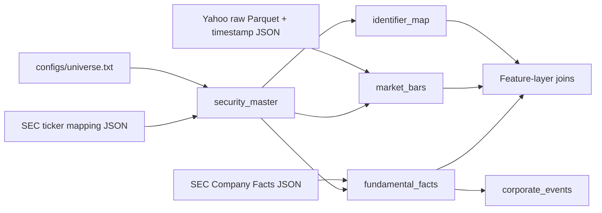

# Data package

Owns the fixed universe, ticker/CIK bridge, Yahoo and SEC clients, raw caching, canonical schemas, ingestion coordination, Parquet snapshots and DuckDB read views. Public interfaces are `load_universe`, `build_security_master`, `yahoo_bars`, `normalize_facts`, `events_from_facts`, `ingest`, `synthetic`, `validate`, `digest` and `write_parquet`.

## Flow and schemas

1. `security_master(security_id, company_id, ticker, exchange, currency, cik, is_active)`
2. `identifier_map(security_id, company_id, ticker, cik)`
3. `market_bars(security_id, ticker, session_date, open, high, low, close, adjusted_close, volume, source, ingested_at)`
4. `fundamental_facts(company_id, security_id, cik, fact_name, fact_value, unit, fiscal_period_start, fiscal_period_end, filed_date, form, accession_number, source, ingested_at)`
5. `corporate_events(company_id, security_id, cik, event_date, event_datetime, event_type, form, accession_number, source, ingested_at)`

Market data are daily and cover the configured history; SEC facts are irregular filing events. Feature code converts them to one row per security/session. Raw downloads are cached and hashed. Curated keys must be non-null and unique where applicable; prices must be finite and positive; volume nonnegative; all identifiers must map. Conflicting SEC fact identities and incomplete live ingestion fail.

Business/research limits: identifiers join by CIK/ticker, never company name; only exact EPS/basic and Net Income concepts are normalized; the event table covers filings containing those concepts; no historical constituent/delisting or general XBRL normalization policy exists. This package must not decide features, models or portfolio policy.
